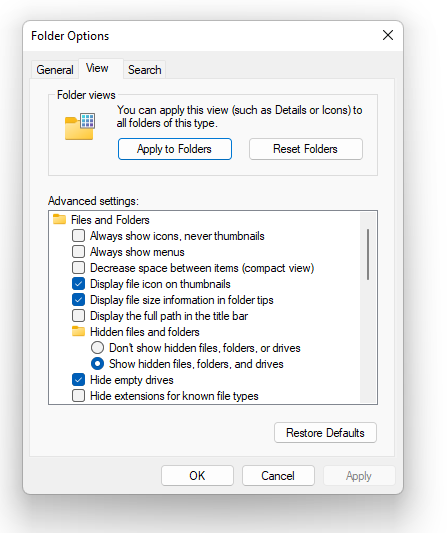

# Labo-00 : Prise en main de l'ordinateur <!-- omit in toc -->

| Type       | Description                                  |
| ---------- | -------------------------------------------- |
| Durée      | 2x45 minutes + Travail à la maison           |
| Rendu      | Sur GitHub   p                               |
| Format     | Travail individuel                           |
| Évaluation | Sur la conformité du rapport et de l'archive |

## Table des matières <!-- omit in toc -->

- [Introduction](#introduction)
- [Objectifs](#objectifs)
- [Système d'exploitation](#système-dexploitation)
- [Prise en main de votre ordinateur](#prise-en-main-de-votre-ordinateur)
  - [Accès au réseau](#accès-au-réseau)
  - [Raccourcis clavier](#raccourcis-clavier)
  - [Votre dossier utilisateur](#votre-dossier-utilisateur)
  - [Configuration des dossiers](#configuration-des-dossiers)
- [Rendu du laboratoire](#rendu-du-laboratoire)
- [Microsoft Word](#microsoft-word)
- [Notepad](#notepad)
- [Calculatrice Windows](#calculatrice-windows)
  - [Conversion d'unités](#conversion-dunités)
- [Installation des outils de développement](#installation-des-outils-de-développement)
  - [Winget](#winget)
  - [Visual Studio Code](#visual-studio-code)
  - [WSL](#wsl)
- [Familiarisation avec Linux](#familiarisation-avec-linux)
  - [Git](#git)
    - [Configuration de Git](#configuration-de-git)
    - [Identité SSH](#identité-ssh)
- [GitHub](#github)
  - [Création d'un compte](#création-dun-compte)
  - [Déploiement des clés](#déploiement-des-clés)
    - [Déploiement de votre clé publique](#déploiement-de-votre-clé-publique)
    - [Précisions sur toutes ces clés](#précisions-sur-toutes-ces-clés)
  - [Découvertes des fonctionnalités de GitHub](#découvertes-des-fonctionnalités-de-github)
- [Acceptation de l'invitation](#acceptation-de-linvitation)
- [Clone du laboratoire](#clone-du-laboratoire)
- [Livraison du rendu](#livraison-du-rendu)
- [Dernière étape](#dernière-étape)
- [Résumé](#résumé)

## Introduction

Ce travail pratique d'introduction permet à l'étudiant la prise en main avec Microsoft Windows et les outils qui seront utilisés durant le semestre. Le cours étant essentiellement orienté vers la ligne de commande, il est plus naturel de s'opter pour un environnement de travail idoine.

## Objectifs

Les objectifs de ce travail sont les suivants :

- découvrir l'environnement Windows et Linux ;
- savoir lire un intitulé de laboratoire ([oui, oui ce n’est pas si facile](https://en.wikipedia.org/wiki/RTFM)) ;
- appliquer la marche à suivre pour obtenir et rendre un travail pratique ;
- découvrir et installer les outils de développement utilisés dans ce cours.

Notons que ceci implique l'écriture d'un rapport... Alors pensez à noter ce que vous faites.

## Système d'exploitation

Vous le savez surement, un ordinateur ne peut fonctionner sans Système d'exploitation. À ce jour les systèmes les plus populaires sont les suivants :

1. [Microsoft Windows](https://fr.wikipedia.org/wiki/Microsoft_Windows)
2. [macOS](https://fr.wikipedia.org/wiki/MacOS)
3. [Linux/Unix](https://fr.wikipedia.org/wiki/Linux)

Selon le domaine d'utilisation, la répartition des parts de marché est très différente. Alors que Windows domine largement la bureautique, Linux/Unix est le système le plus utilisé dans les serveurs et les périphériques embarqués. Votre téléphone Android tourne sous Linux, votre iPhone est une base Unix, votre Tesla sous Linux, et même les satellites de SpaceX utilisent Linux.

| OS         | Bureautique | Ingénierie | Serveurs et Périphériques |
| ---------- | ----------- | ---------- | ------------------------- |
| Windows    | 75%         | 40%        | 15%                       |
| macOS      | 20%         | 50%        | 5%                        |
| Linux/Unix | 5%          | 10%        | 80%                       |

Face à cette concurrence rude, Microsoft offre depuis 2016 un produit logiciel nommé **Windows Subsystem for Linux**, de son petit nom **WSL**. Il s'agit d'une [distribution Linux](https://fr.wikipedia.org/wiki/Distribution_Linux) tournant dans Windows. Elle présente l'avantage d'être bien normalisée (respect du standard [POSIX](https://fr.wikipedia.org/wiki/POSIX)), et offre des bases solides pour plus tard développer sur [Raspberry PI](https://fr.wikipedia.org/wiki/Raspberry_Pi) et d'autres [systèmes embarqués](https://fr.wikipedia.org/wiki/Syst%C3%A8me_embarqu%C3%A9).

C'est cet outil, WSL, qui sera proposé pour le semestre. Les utilisateurs de [macOS](https://fr.wikipedia.org/wiki/MacOS) et de [Linux](https://fr.wikipedia.org/wiki/Linux) n'auront pas besoin de cet outil et pourront développer sans machine virtuelle Windows.

Nous verrons plus bas comment installer cet outil, mais d'abord familiarisons-nous avec Windows.

## Prise en main de votre ordinateur

### Accès au réseau

Démarrez votre ordinateur et connectez-vous au réseau WiFi de l'école en utilisant vos identifiants personnels. Votre login est votre prénom et votre nom séparé par un point. Votre nom de famille pourrait être tronqué si l'ensemble dépasse 13 caractères. Votre mot de passe c'est... bah votre mot de passe... Il se pourrait que vous deviez aussi préfixer votre login par le nom du domaine informatique de l'école (`einet.ad.eivd.ch`) ou simplement `einet`. Ainsi vous pourriez avoir quelque chose comme : `einet\yves.chevalli`.

> Notez qu'en informatique on utilise volontiers quelques astuces pour éviter d'utiliser les espaces. L'une est de séparer les mots par des majuscules : `YvesChevallier` (PascalCase), l'autre de laisser la première lettre en minuscule, car elle ne sépare pas un mot: `yvesChevallier` (camelCase). Une autre méthode est d'utiliser un pic à viande (le tiret `-`) : `yves-chevallier` (kebab-case). Enfin, la méthode la plus ancienne est d'utiliser le souligné (underscore `_`) : `yves_chevallier` (snake_case). La notation retenue par la HEIG-VD est `yves.chevallier` (dot.case) plus utilisée dans les adresses e-mail et le réseau.

Une fois connecté, parvenez-vous à :

1. Accéder à votre boîte e-mail ? (https://mail.hes-so.ch) ?
2. Accéder à Microsoft Teams depuis votre boîte email ?
3. Accéder à l'intranet de l'école ? (http://intra.heig-vd.ch/) ?

### Raccourcis clavier

Un "vrai informaticien" utilise son clavier pour tout faire, avec l'expérience on s'aperçoit que c'est plus rapide et plus efficace que d'utiliser la souris. Apprendre les raccourcis clavier est un investissement qui paye toujours. Voyons ensemble quelques raccourcis clavier utiles sous Windows.

Tout d'abord utiliser votre menu démarrer :

1. Un bref appui sur la **touche Windows** positionnée sur le clavier à gauche de la barre d'espace et entre `<CTRL>` et `<ALT>` ouvre le menu **démarrer** duquel vous accédez à vos programmes.
2. Une frappe au clavier alors que le menu Démarrer est ouvert vous permet la recherche de programmes.
3. Recherchez par exemple `calc` puis appuyez sur `<ENTER>`, la calculatrice Windows s'ouvre.

Une approche un peu plus efficace est d'utiliser le menu **exécuter** :

1. La combinaison de touches `<WIN>`+`<R>` fait apparaître le menu **exécuter**.
2. L'invité de dialogue du menu exécuter vous permet d'entrer un nom de programme.
3. Saisissez `notepad` puis appuyez sur `<ENTER>`, l'éditeur de texte Notepad s'ouvre.

La touche Windows permet d'autres raccourcis clavier très utiles :

- La combinaison de touches `<WIN>`+`<E>` fait apparaître l'explorateur de fichiers qui vous permet de naviguer dans votre arborescence de fichiers
- La combinaison de touches `<WIN>`+`<L>` verrouille votre ordinateur.
- La combinaison de touches `<WIN>`+`<MAJ>`+`<S>` fait apparaître l'outil de capture d'écran.
- La combinaison de touches `<WIN>`+`<D>` affiche le bureau, répétez l'opération et vous revenez à votre fenêtre précédente.
- La combinaison de touches `<WIN>`+`<V>` affiche le presse-papier de Windows, il vous permet d'utiliser plusieurs fois des éléments copiés.

Essayez ces différents raccourcis.

Les raccourcis clavier sont nombreux, et ils améliorent le confort de travail. Plus vous en connaissez, la meilleure est votre productivité. Plus vous en connaissez, mieux vous structurez votre esprit à comprendre les machines. Au début c'est contraignant, puis cela peut devenir ludique.

>Pour plus de rigueur, nous définissions ici comment sont notés les raccourcis clavier : une séquence au clavier peut être exprimée comme une suite de combinaisons de touches. Les **chevrons** `<>` sont ici utilisés pour différentier un ou des caractères d'une touche du clavier. Par exemple, la touche de tabulation (↹) sera indiquée `<TAB>` alors que `TAB` correspondra à la frappe des trois caractères sur le clavier : `T`, `A` et `B`. Lorsque des touches sont séparées par le signe `+` il s'agit alors d'une combinaison de touches. C'est-à-dire le maintien simultané des touches concernées. Dès lors `<CTRL>`+`<R>` correspond à maintenir la touche **contrôle** pendant que la touche `R` est appuyée. Sur internet et dans de nombreuses documentations, cette notation est souvent abrégée et ce même raccourci peut s'écrire `<C-R>`. À vous d'interpréter convenablement ces écritures selon le contexte.

Avez-vous compris ? Voici deux séquences de touches (que vous pouvez exécuter les yeux fermés), que font-elles ?

```text
<WIN>+<R> calc <ENTER> <ALT>+<1> <ESC> 3.14 * 2 = <CTRL>+<C> <ALT>+<F4>
```

```text
<W-R> notepad <ENTER> <C-V> <C-S> two-pies.txt <ENTER>
```

### Votre dossier utilisateur

Exécutez `%userprofile%` depuis le menu *exécuter* (`<W-R>`), l'explorateur de fichiers s'ouvre. Quel est ce dossier ? Si vous ne savez pas, cherchez une référence utile sur internet.


Ce dossier est celui où sont stockés vos documents, images, vidéos, téléchargements, etc. C'est votre espace personnel sur l'ordinateur. Vous y trouverez aussi des dossiers cachés qui contiennent des paramètres et des configurations pour vos applications.

### Configuration des dossiers

Par défaut sous Windows, la configuration n'est pas optimale pour un ingénieur. Nous allons donc modifier quelques paramètres.

Exécutez :

```text
<WIN>+<R> control folders <ENTER>
```



Cela lance l'outil de configuration des dossiers. Allez dans le second onglet (`View` ou `Affichage`) et assurez-vous des options suivantes:

- **Cocher** *Display the full path in the title bar* (Afficher le chemin complet dans la barre de titre)
- **Cocher** *Show hidden files, folders and drives* (Afficher les fichiers, dossiers et lecteurs cachés)
- **Décocher** *Hide extensions for known file types* (Masquer les extensions des fichiers dont le type est connu)

La seconde option vous permet de voir les fichiers et dossiers cachés, qui sont des fichiers et dossiers qui ne sont pas affichés par défaut. Par exemple, le fichier `.gitignore` est un fichier caché qui permet de spécifier les fichiers à ignorer dans un dépôt Git. Nous verrons cela plus tard.

La troisième option vous permet de voir les extensions des fichiers, ce qui est très utile pour identifier les fichiers. Par exemple, un fichier `hello.c` est un fichier source C, alors qu'un fichier `hello.exe` est un exécutable. Par défaut il n'est affiché que `hello` et vous ne savez pas ce que c'est.

## Rendu du laboratoire

Durant ce travail pratique, vous l'avez maintenant compris, plusieurs documents seront à rendre. Pour se préparer à ce rendu, commencez tout d'abord par créer un dossier :

1. Dans `Mes Documents` ou sur votre bureau, créez un dossier intitulé `rendu`.
2. Placez-y le fichier `two-pies.txt` créé plus haut.
3. Constatez que ce dossier contient maintenant un seul et unique fichier.

*Spoiler alert* : à la fin de ce travail, vous aurez dans votre dossier la structure suivante :

```text
./rendu
├── README.md
├── anaphore.txt
├── document.xml
├── hello
├── hello.c
├── rapport.docx
└── two-pies.txt
```

Notez la notion de hiérarchie, le dossier `rendu` contient plusieurs fichiers. Cette hiérarchie est elle-même située dans une autre hiérarchie, celle de votre dossier personnel. C'est ce que l'on appelle un arbre de fichiers, ou arborescence.

## Microsoft Word

Microsoft Office est la suite de bureautique la plus utilisée dans l'industrie, que vous la détestiez ou l'adoriez, vous serez inévitablement amené à l'utiliser dans votre future carrière professionnelle. À cette fin, il vous est demandé de rédiger un compte rendu Microsoft Word en respectant les étapes suivantes :

1. Démarrer Microsoft Word avec `<WIN>+<R> winword <ENTER>`.
2. Créez un nouveau document.
3. Cherchez le menu `Styles` et sélectionnez `Titre` et entrez `Rapport de laboratoire`.
4. Sélectionnez `Sous-titre` et entrez `Laboratoire 00: Familiarisation avec l'ordinteur`.
5. Constatez que la faute d'orthographe se souligne en rouge (ordinateur ne s'écrit pas ordinteur).
6. Utiliser un clic droit sur la faute pour la corriger.
7. Entrez ensuite votre nom, prénom et la date du jour.
8. Insérez une section avec `<CTRL>+<ALT>+<1>` intitulée `Microsoft Word`.
9. Faite une capture d'écran pour l'insérer dans votre rapport. Ici une illustration d'une mise en abîme :

   

10. Gardez votre document ouvert pour la suite des opérations.
11. ... Une fois toutes les autres étapes terminées, sauvegardez votre rapport dans votre dossier de rendu.

Notez au passage que ce fichier porte l'extension `.docx`, c'est une extension de fichier Microsoft Word. Le `x` signifie que le fichier utilise le format `XML` compressé pour stocker les données, un format unifié avec les nouvelles version de Word. En réalité ce fichier est une archive qui contient une arborescence d'autres fichiers qui peuvent être ouverts avec un éditeur de texte.

Essayez par exemple de créer un nouveau fichier Word qui contient la phrase `les biscuits aux beurre`. Sauvegardez ce fichier avec le nom `biscuit.docx`. Puis, renommez le fichier avec l'extension `.zip`. Vous constatez que l'icône du fichier a changé. En ouvrant ce fichier, vous aurez une arborescence de l'archive compressée. Jetez un œil au fichier `document.xml` en l'ouvrant dans `notepad` et vous verrez que le texte est bien présent :

```xml
<w:p w14:paraId="0F5C4F6A"
     w14:textId="4920233C" w:rsidR="00557DE2" w:rsidRDefault="00A65091">
   <w:r>
         <w:t>les biscuits au beurre</w:t>
   </w:r>
</w:p>
```

Intégrez ce fichier `document.xml` à votre dossier de rendu.

## Notepad

Notepad est un éditeur de texte très moyenâgeux, mais diantrement utile.


1. Ouvrez l'éditeur de texte `notepad` depuis `<WIN>+<R> notepad <ENTER>`
2. Saisissez le programme C suivant (sans oublier de changer le nom de l'auteur...) :

   ```c
   /**
   * My first program in C
   * Author: Brian Kernighan <brian.kernighan@hello-world.com>
   **/
   #include <stdio.h>

   int main() {
      printf("hello, world\n");
      return 0;
   }
   ```

3. Sauvegardez-le sous le nom `hello.c` dans votre dossier de rendu.
   1. Veillez à ne pas choisir "Document Texte" lors de la sauvegarde pour que l'extension du fichier soit `.c` et non `.c.txt`
4. Quelle est la version de Notepad que vous utilisez ?

Vous ne savez pas répondre au point 4 ? Utilisez Google, c'est votre meilleur ami.

**Rappel:** pour vous assurer que les fichiers ont la bonne extension (les caractères qui suivent le `.` (point), veillez à activer l'option Windows : "Ne pas masquer les extensions des fichiers dont le type est connu". Pour le faire, rendez-vous sous Google et essayez par exemple : "montrer extension fichier Windows 10".

Au passage, bravo, vous venez d'écrire votre premier programme C à l'école d'ingénieurs. Vous êtes un vrai hacker !

## Calculatrice Windows

Commencez pas collecter quelques informations liées à cette calculatrice :

1. Démarrez la calculatrice Windows en écrivant `calc` dans le menu *exécuter*.
2. Démarrez votre navigateur internet en recherchant `edge` ou `chrome` dans la barre de recherche du menu démarrer.
    1. Cherchez `windows 10 calculator shortcuts`
    2. Trouvez dans les résultats de recherche un site donnant les raccourcis clavier pour :
       1. afficher le mode scientifique,
       2. calculer la racine carrée,
       3. afficher le mode programmeur,
          1. choisir le mode `HEX`,
          2. choisir le mode `OCT`,
          3. choisir le mode `BIN`.
3. Ouvrez le menu en haut à gauche et observez les différents modes de conversions:
   1. conversions de longueur,
   2. modes de calculatrice.

### Conversion d'unités

La calculatrice est aussi très pratique pour faire des conversions d'unités. Essayez les opérations suivantes :

1. Convertir une température de Farenheit en Celsius. Faites une capture d'écran à placer dans votre rapport
   
2. Trouver la puissance mécanique équivalente à 42 Chevaux vapeurs:
   1. la petite icône `Cheval` doit montrer `42`.
   2. Capturez la fenêtre de la calculatrice avec `<WIN>+<MAJ>+<S>`.
   3. Insérer la capture dans votre rapport.
3. Entrez en **mode programmeur**
4. Agrandissez la fenêtre pour voir apparaître la mémoire à droite
   1. Saisir en hexadécimal (HEX) la valeur `BEADBEEF`
   2. Quel est l'équivalent en décimal (DEC) et en binaire (BIN) ?
   3. Entrez en mode d'édition des bits (deuxième tab)
      1. Commutez les bits 0, 4, 6, 10, 16, 17, 20, 22, 26 et 28
      2. Quelle est maintenant la valeur (HEX) que vous lisez ?
   4. Faite une capture d'écran avec le mode de changement de bits activé.

## Installation des outils de développement

À présent, on vous propose d'installer quelques outils qui vous seront utiles pour la suite de votre bachelor et peut-être même votre master, et peut-être même plus tard lorsque vous serez dans l'industrie.

- **WSL** : un système Linux pour Windows, permettant d'être compatible POSIX
- **Git** : un logiciel de gestion de version logiciel
- **Visual Studio Code** : un éditeur de code

### Winget

[winget](https://docs.microsoft.com/en-us/windows/package-manager/winget/) est un gestionnaire de paquets pour Windows. Il permet d'installer des logiciels en ligne de commande. C'est une excellente solution afin d'éviter de télécharger des logiciels sur des sites douteux. Pour installer un logiciel, il suffit de taper la commande `winget install nom_du_logiciel`. Souvent les logiciels ont des noms différents de ceux que vous connaissez. La procédure est la suivante :

1. Allez sur <https://winget.run/>
2. Chercher le programme que vous voulez installer (p.ex. VisualStudioCode)
3. Copiez la commande `winget install nom_du_logiciel`
4. Ouvrez un terminal Windows (Windows Terminal) et collez la commande
5. Appuyez sur `<ENTER>`

### Visual Studio Code

[Visual Studio Code](https://code.visualstudio.com/) est un éditeur de code extensible développé par [Microsoft](https://fr.wikipedia.org/wiki/Microsoft) pour Windows, Linux et macOS. Il est un bon point de départ pour programmer dans différents langages (C, C++, Python, JavaScript, Perl, Java...).

Cet éditeur a été choisi pour ce cours, car il est très complet, assez léger et surtout, il fonctionne très bien avec WSL sous macOS et naturellement sous Linux.

> Vous pouvez vous rendre sur [2024 Developer Survey](https://survey.stackoverflow.co/2024/) et descendre à *Integrated development environment* [ici](https://survey.stackoverflow.co/2024/technology/#1-integrated-development-environment). Constatez quel est l'éditeur le plus populaire dans la communauté en 2024.

Allez, en avant, installons Visual Studio Code...

1. Installer Visual Studio Code (vous pouvez utiliser `winget` pour cela)
2. Exécutez Visual Studio Code
3. Avec le raccourci `<CTRL>+<K> <CTRL>+<O>`, ouvrez votre dossier de rendu :
   1. sur la gauche de la fenêtre, vous avez la liste des fichiers de votre dossier.
4. Ouvrez le fichier `hello.c` que nous avons écrit plus haut.
5. Notez que cette fois-ci vous avez des couleurs.
6. Avec `<CTRL>+<SHIFT>+<P>` faites apparaître le menu de commande et cherchez `Preferences: Color Theme` et choisissez un thème qui vous convient.
7. Faites une capture d'écran et intégrez là dans votre rapport.

*Note importante* : L'anglais est **la langue de la programmation**. Il est donc important de s'habituer à lire et écrire en anglais. Si vous avez des difficultés, vous pouvez utiliser un traducteur en ligne. Cela va de même pour la langue de vos logiciels. Forcez-vous à utiliser Visual Studio Code en anglais. Vous pouvez changer la langue de l'interface en allant dans `File > Preferences > Language`.

Créez un nouveau fichier `anaphore.txt` et écrivez-y l'anaphore célèbre de Aragon (Strophes pour se souvenir):

> Vingt et trois qui donnaient le cœur avant le temps
> Vingt et trois étrangers et nos frères pourtant
> Vingt et trois amoureux de vivre à en mourir

Vous constatez que le mot `trois` apparaît `trois` fois. Vous pouvez placer votre curseur sur ce mot et utiliser le raccourci `<CTRL>+<D>` pour sélectionner les autres occurrences de ce mot, répétez le raccourci pour sélectionner toutes les occurrences. Vous pouvez ensuite les modifier en même temps. Essayez de changer le mot `trois` en `quatre` et constatez que les autres occurrences sont modifiées en même temps. Félicitation, vous venez d'utiliser l'option **multicurseurs** de Visual Studio Code.

Intégrez le fichier `anaphore.txt` modifié dans votre dossier de rendu.

Utilisez la combinaison `<CTRL>+<SHIFT>+<X>` pour afficher les extensions et installez les extensions suivantes :

- C/C++ Extension Pack
- Clang-Format
- WSL
- Markdown All in One

### WSL

[Windows Subsystem for Linux](https://en.wikipedia.org/wiki/Windows_Subsystem_for_Linux) est une couche de compatibilité pour Windows permettant de faire tourner un vrai système Linux sur votre ordinateur Windows. Si vous avez peur de la ligne de commande, n'ayez crainte, nous allons avidement l'utiliser durant ce cours.

**WSL** permet de simplifier le développement de nombreux logiciels prévu pour être compatible POSIX (comme les téléphones Android). Installer WSL vous permettra de suivre quelques exemples cités dans le cours plus simplement que sous Windows.

Pour installer ce système, vous avez plusieurs solutions ; voici la première :

1. Utilisez la [documentation](https://learn.microsoft.com/en-us/windows/wsl/install) de Microsoft pour installer WSL
2. Choisissez comme distribution **Ubuntu 24.04 LTS**

Une fois WSL et Ubuntu installés, effectuer les opérations suivantes :

1. Exécutez le programme `Ubuntu` maintenant installé
2. Après quelques instants, il vous est demandé de saisir un nom d'utilisateur puis un mot de passe, choisissez un mot de passe assez simple, il n'est pas très important. **Attention, le mot de passe ne s'affiche pas lorsque vous le saisissez**, c'est normal et c'est pour des raisons de sécurité.

**Important** : Ne sautez pas cette étape. Créez un utilisateur par exemple vos initiales. Pour le mot de passe, ne vous embêtez pas, utilisez quelque chose de simple, car vous en aurez besoin souvent.

**Important** : N'oubliez pas votre mot de passe ! Notez-le au besoin quelque part.

## Familiarisation avec Linux

Pour se familiariser avec les exécutables Linux essayons d'installer un programme. Tout d'abord vous devez lancer un terminal. Exécutez Windows Terminal puis depuis le menu déroulant `v` juste à droite du `+` sélectionnez `Ubuntu`.

Depuis l'invité de commande qui s'offre à vous :

1. Mettre à jour la liste des logiciels disponibles avec `sudo apt update`
2. Installez le programme `sl` puis exécutez-le avec `sl` (c'est un train qui passe dans votre terminal).

On va maintenant installer un autre programme :

1. Installer le programme `cowsay` (vache qui parle) avec `sudo apt install cowsay`
2. Exécuter `cowsay` suivi d'une phrase de votre choix, p. ex. :

   ```text
   $ cowsay Meuuuuuh
   __________
   < Meuuuuuh >
   ----------
         \   ^__^
          \  (oo)\_______
             (__)\       )\/\
                ||----w |
                ||     ||
   ```

3. Affichez le manuel du programme avec la commande `man cowsay` (quittez le manuel avec la touche `q`, naviguez avec `j` et `k`).
4. Cherchez dans le manuel que fait l'option `-d`
5. Essayez cette option
6. Essayez une autre option possible de ce programme, copiez le texte de sortie et insérez-le dans votre rapport.
7. À votre avis, quelle ligne de commande permet d'afficher ceci ?

   ```text
   _____________________
   ( Bilbon, je t'aurais )
   ---------------------
         o                    / \  //\
         o    |\___/|      /   \//  \\
               /0  0  \__  /    //  | \ \
            /     /  \/_/    //   |  \  \
            @_^_@'/   \/_   //    |   \   \
            //_^_/     \/_ //     |    \    \
         ( //) |        \///      |     \     \
         ( / /) _|_ /   )  //       |      \     _\
      ( // /) '/,_ _ _/  ( ; -.    |    _ _\.-~        .-~~~^-.
   (( / / )) ,-{        _      `-.|.-~-.           .~         `.
   (( // / ))  '/\      /                 ~-. _ .-~      .-~^-.  \
   (( /// ))      `.   {            }                   /      \  \
   (( / ))     .----~-.\        \-'                 .~         \  `. \^-.
               ///.----..>        \             _ -~             `.  ^-`  ^-_
                  ///-._ _ _ _ _ _ _}^ - - - - ~                     ~-- ,.-~
                                                                     /.-~
   ```

Ce que vous devez retenir c'est que:

- Pour installer un programme sous Linux Ubuntu il faut utiliser la commande `apt install` suivi du nom de la commande que vous voulez utiliser.
- Pour consulter l'aide d'un programme, utilisez le programme `man` qui affiche le manuel d'un programme.
- L'appel des programmes peut être modifié avec des options comme `-d`.

### Git

Git est un logiciel de gestion de version très utilisé par les développeurs de logiciels. Il est utilisé dans ce cours comme outil principal pour accéder aux énoncés de laboratoire et soumettre vos modifications. Avantageusement, Git est déjà installé avec Ubuntu 24.04, mais nous devons le configurer avant de pouvoir l'utiliser.

#### Configuration de Git

[Git](https://git-scm.com/) utilise deux informations pour vous identifier : votre **nom** et votre **e-mail**. Pour configurer votre identité, exécutez depuis un terminal Ubuntu puis les commandes suivantes en remplaçant ce très cher `Emmet` par votre humble patronyme :

   ```sh
   git config --global user.name "Emmet Lathrop Brown"
   git config --global user.email emmet.brown@heig-vd.ch
   ```

Notez au passage la structure de ces commandes :

1. `git` c'est le nom du programme que vous exécutez
2. `config` c'est une *sous commande* permettant de configurer Git
3. `--global` il s'agit d'un modificateur reconnaissable à ses deux tirets, qui indique que nous souhaitons modifier la configuration globalement dans tout Ubuntu
4. `user.name` c'est le paramètre de configuration que vous voulez modifier
5. `"Emmet Lathrop Brown"` c'est une chaîne de caractère comportant le prénom suivi du nom.

> Chacun des éléments passés après le nom du programme est nommé des **arguments**, et les arguments qui commencent par un tiret simple ou double sont nommés des **options**.

#### Identité SSH

Maintenant que votre identité est saisie, nous souhaitons créer une clé cryptographique pour vous permettre de communiquer à l'abri des mauvaises oreilles avec d'autres ordinateurs sur internet. Cette clé s'appelle *clé SSH* pour *Secure SHell* (littéralement coquille sécurisée, mais tout le monde utilise le terme *shell*).

Pour créer votre clé, utilisez simplement la commande:

```sh
ssh-keygen
```

Utilisez toutes les valeurs par défaut (c'est-à-dire appuyez sur `<Enter>` jusqu'à la fin du programme). Dans le cas de ce cours, et à moins que vous ne travaillez aussi pour une agence de renseignement, je vous propose de laisser la `passphrase` (phrase secrète) vide.

> N'entrez pas de passphrase, appuyez simplement sur `<Enter>`.

À l'issue de cette étape, vous obtiendrez quelque chose comme ceci:

```sh
Generating public/private ed25519 key pair.
Enter file in which to save the key (/home/ycr/.ssh/id_ed25519): (appuyez sur <Enter>)
Created directory '~/.ssh'.
Enter passphrase (empty for no passphrase):
Enter same passphrase again:
Your identification has been saved in ~/.ssh/id_ed25519.
Your public key has been saved in ~/.ssh/id_ed25519.pub.
The key fingerprint is:
SHA256:roMkIIUQP4DcTzitPsPCNjIA/myLCwZbjkQl0wJ6xm0 john-doe@einet
The key's randomart image is:
+--[ED25519 256]--+
|        o+o o    |
|       + ..*     |
|      = o o o    |
|     o = *.o     |
|      o Sooo.    |
|       =ooo.o. . |
|      .oO.o=o o  |
|       +E@.ooo   |
|     .o =o+ .    |
+----[SHA256]-----+
```

Ce programme a créé deux clés:

- Une **clé privée** que vous ne devez jamais communiquer à personne (ni même votre professeur, vos amis ou votre maître chanteur)
- Une **clé publique** que vous pouvez transmettre à ceux qui souhaitent communiquer avec vous.

La clé publique découle de la clé privée. Elle y est intrinsèquement liée. Si vous perdez votre clé privée, vous ne pourrez plus communiquer avec les autres ordinateurs. Si vous perdez votre clé publique, vous pourrez toujours communiquer avec les autres ordinateurs, mais personne ne pourra communiquer avec vous.

Plus haut nous avons pu lire: `Your public key has been saved in ~/.ssh/id_rsa.pub` (*Votre clé publique a été sauvée dans ~/.ssh/id_rsa.pub*). Pour consulter votre clé, utilisez le programme `cat` qui permet de voir le contenu d'un fichier :

```sh
cat ~/.ssh/id_ed25519.pub
```

Vous devriez obtenir un texte étrange avec plein de chiffres et de lettres de `a` à `f` et commençant par `ssh-ed25519`. Copiez ce texte et insérez-le dans votre rapport. Par exemple, ma propre clé SSH publique est la suivante :

```sh
ssh-ed25519 AAAAC3NzaC1lZDI1NTE5AAAAIBiKGoMLwS80YMnoMz4AXNGlt9EoVZbZ0WE5MVPKp1DU yves@chevallier.io
```

Maintenant, si vous voulez **impressionner votre professeur et gagner des points supplémentaires**, mettez dans votre rapport le contenu de votre clé privée accessible depuis `cat ~/.ssh/id_ed25519`.

## GitHub

[GitHub](https://github.com/) est une plateforme internet pour les développeurs permettant le partage et la collaboration de projets *open source*. Nous avons vu plus haut que le code source de la calculatrice Windows est sur GitHub de même que plus de 100'000'000 d'utilisateurs et de 300'000'000 de projets. Étant donné que cet outil est massivement utilisé dans le développement logiciel, il est bon que tout-e étudiant-e en ingénierie soit familiarisé-e avec. Aussi, les travaux pratiques utiliseront le plus souvent Git et GitHub.

### Création d'un compte

Avant toute chose, et si ce n'est pas déjà fait, il vous faut créer un compte GitHub.

1. Allez sur [GitHub](https://github.com/)
2. Sélectionnez `Sign Up` et créer un compte GitHub.
3. Choisissez un `username` à votre convenance. Pour simplifier le travail du professeur, utilisez `prenom-nom` en **minuscule** et avec un tiret. De plus, c'est la convention d'usage de nommer en minuscule les mots séparés par des tirets (On appelle ça le kebab-case à l'image de mots en transpercés par une pique de fer).
4. Utilisez (dans la mesure du possible) votre e-mail de la HEIG-VD afin de bénéficier des avantages du Campus Program.

### Déploiement des clés

Cette étape est importante, car elle vous permettra de communiquer avec GitHub de façon sécurisée. Nous allons déployer votre clé SSH.

#### Déploiement de votre clé publique

Vous rappelez-vous, nous avions créé une clé `SSH` pour sécuriser nos transactions avec Git. Il est temps d'ajouter cette clé à votre compte GitHub.

1. Ayez sous la main votre clé public de la forme:

   ```text
   ssh-ed25519
   AAAAC3NzaC1lZDI1NTE5AAAAIBiKGoMLwS80YMnoMz4AXNGlt9EoVZbZ0WE5MVPKp1DU
   doc@hill-valley
   ```

2. Rendez-vous sur GitHub dans vos préférences puis dans l'onglet *SSH and GPG keys*.
3. Ajoutez une nouvelle clé SSH avec *New SSH key*.
4. Copier/coller votre clé publique.
5. Nommez votre clé `HEIG-VD`.

#### Précisions sur toutes ces clés

Votre identifiant GitHub (login/password) vous permet d'accéder au site internet de GitHub et de protéger son accès. La clé SSH permet d'échanger des données de façon sécurisée entre votre ordinateur et GitHub sans devoir entrer votre mot de passe à chaque fois. C'est une sorte de contrat tacite. Cela sera utile pour le rendu de labos. Enfin, la clé GPG permet de signer numériquement les transactions que vous ferez avec GitHub, ce qui est optionnel bien entendu.

Votre clé SSH vous permet aussi d'accéder à d'autres ordinateurs à distance depuis Linux (par exemple un Raspberry PI), elle n'est pas uniquement dédiée à Git. Votre clé GPG aussi peut être utilisée pour d'autres applications. Vous pouvez par exemple chiffrer des documents, créer des messages secrets, etc.

### Découvertes des fonctionnalités de GitHub

1. Rendez-vous sur le fichier [addrman.cpp](https://github.com/bitcoin/bitcoin/blob/d0f81a96d9c158a9226dc946bdd61d48c4d42959/src/addrman.cpp) du code source des Bitcoin
2. Cherchez s'il y a une [Delorean](https://fr.wikipedia.org/wiki/DeLorean_DMC-12) dans le fichier (`<CTRL>+<F>`).
4. Cliquez sur le numéro de la ligne incriminée
5. Cliquez sur les trois petits points
6. Sélectionner *View git blame*
7. Cliquez l'avatar de la personne concernée par ce changement.
    1. Quel est son prénom ?
    2. Est-il barbu ?
    3. Porte-t-il des lunettes ?
    4. Dans quelle école a-t-il obtenu son doctorat ?

Expliquez dans votre rapport ce que vous avez compris de cette fonctionnalité `Git Blame`.

## Acceptation de l'invitation

Votre professeur vous a envoyé un lien vers un travail **GitHub Classroom**, cliquez sur ce lien, sélectionnez votre nom et acceptez l'invitation en cliquant sur *Accept this assignment*. Un message indique :

>You accepted the assignment, Labo-00 . We're configuring your repository now. This may take a few minutes to complete. Refresh this page to see updates.

Patientez quelques secondes puis rafraichissez la page avec la touche F5. Vous aurez le message:

>You’re ready to go!
>You accepted the assignment, Labo-00.
>Your assignment repository has been created:
><https://github.com/info1-tin-b/labo-00-votre-nom>

Cliquez sur le lien puis cliquez sur le bouton vert `Code`. Choisissez `SSH` et copiez l'adresse du référentiel. Elle devrait ressembler à quelque chose comme :

```sh
git@github.com:info1-tin-b/labo-00-votre-nom.git
```

## Clone du laboratoire

Pour récupérer une copie de votre travail, vous devez faire un *clone* de votre *référentiel*. Maintenant que vous avez copié l'adresse de votre référentiel, effectuez les opérations suivantes :

1. Lancer un terminal Ubuntu
2. Cloner le référentiel de ce travail pratique avec la commande suivante :

   ```sh
   git clone git@github.com:heig-vd-tin/info1-labo-00-votre-nom.git
   ```

3. Naviguer dans ce répertoire avec `cd info1-labo-00-votre-nom` (vous pouvez simplement écrire `cd inf` puis appuyer sur la touche `TAB` pour compléter le nom du répertoire automatiquement).
4. Ouvrez le projet avec Visual Studio Code avec `code .` (n'oubliez pas l'espace et le point)

C'est principalement ces commandes que vous répéterez tout au long du semestre : `git clone`, `cd`, `code .`.

## Livraison du rendu

Pour livrer votre travail, il vous est demandé de publier vos fichiers sur GitHub.

Depuis votre terminal Ubuntu, dans le répertoire `info1-labo-00` récupéré, créez un dossier `rendu` avec la commande `mkdir rendu`. Puis, déplacez-vous dans ce dossier avec `cd rendu`. Avec la commande `explorer.exe .` (n'oubliez pas le point), vous ouvrez l'explorateur de fichier Windows dans le dossier courant. Vous pouvez copier les fichiers demandés dans ce dossier.

À partir de la console, il faut maintenant ajouter les fichiers à la liste des fichiers à publier avec la commande `git add .`. Puis, il faut créer un *commit* avec la commande `git commit -m "Travail terminé"`. Enfin, il faut publier les changements avec la commande `git push`.

Rendez-vous sur GitHub et vérifiez que vos changements ont bien été publiés. Votre professeur peut maintenant y accéder directement et évaluer votre travail.

## Dernière étape

Pour terminer ce travail pratique, il vous est demandé de créer un fichier `README.md` dans le dossier `rendu` avec le contenu suivant :

```markdown
# Labo-00

Ce dossier contient le rendu de mon laboratoire Info1, j'ai été heureux de le réaliser.

Je me suis familiarisé un peu avec Markdown, ci dessous quelques exemples de ce que l'on peut faire avec :

> Vous vous inspirerez du fichier source de la donnée du laboratoire (fichier README.md à la racine du référentiel) pour donner quelques exemples de ce que l'on peut faire en Markdown.
```

Notez que vous pouvez visualiser ce que vous écrivez en direct dans Visual Studio Code. Pour cela, vous pouvez utiliser la commande `Markdown: Open Preview to the Side` depuis le menu des commandes, ou depuis le racourci `<CTRL>+<K> <V>`.

Une fois terminé il ne reste que trois commandes à utiliser :

1. `git add rendu/README.md`
2. `git commit -m "Ajout fichier Markdown"`
3. `git push`

## Résumé

Bravo, vous venez de terminer ce premier travail pratique. Durant toute la procédure, vous avez pu :

- Accéder aux infrastructures réseau de l'école
- Créer un rapport Word
- Installer Linux sous Windows
- Configurer Git
- Créer un compte sur GitHub
- Créer une clé SSH
- Installer Microsoft Visual Studio Code (VsCode)
- Observer que la Calculatrice Windows est open source et qu'elle renferme de nombreuses fonctionnalités intéressantes
- Utiliser un peu GitHub et Git
- Se familiariser avec la syntaxe Markdown
- Exécuter des programmes sous Linux comme `cowsay`
- Livrer votre travail sur GitHub
