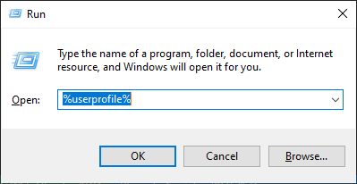
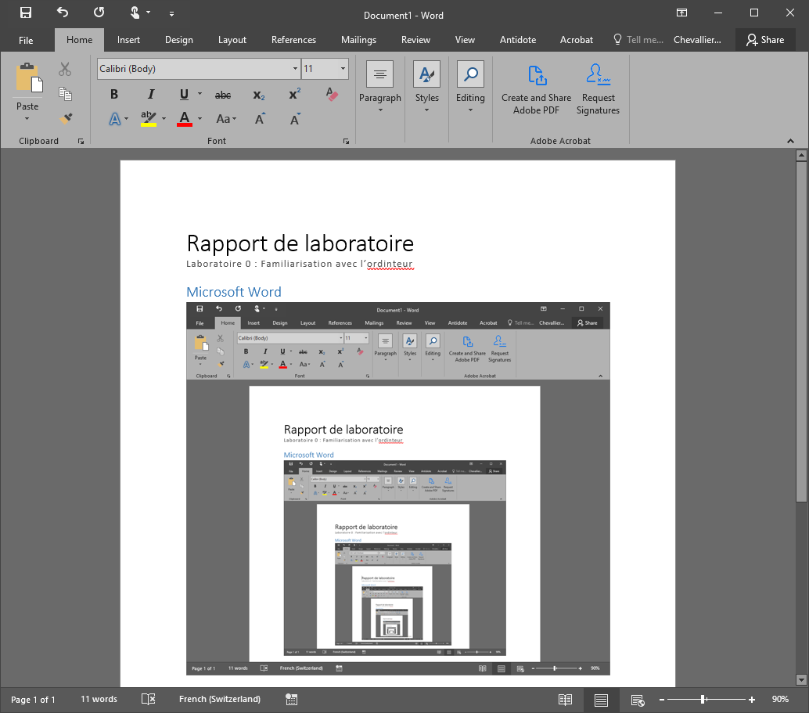
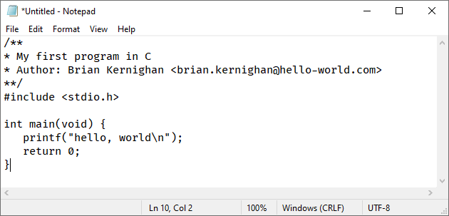
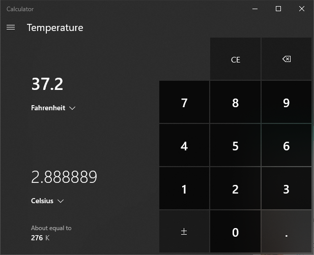
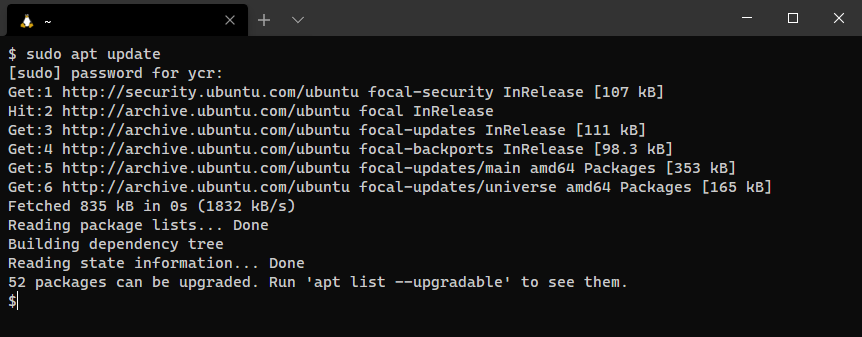

# Prise en main de l'ordinateur

**Durée: 2x45 minutes + travail à la maison**

**Rendu: dimanche soir avant minuit**

<!-- TOC -->

- [Prise en main de l'ordinateur](#prise-en-main-de-lordinateur)
  - [Introduction](#introduction)
  - [Objectifs](#objectifs)
  - [Prise en main de votre ordinateur](#prise-en-main-de-votre-ordinateur)
  - [Rendu du laboratoire](#rendu-du-laboratoire)
    - [Microsoft Word](#microsoft-word)
    - [Notepad](#notepad)
    - [Calculatrice Windows](#calculatrice-windows)
  - [Informatique à la HEIG-VD](#informatique-à-la-heig-vd)
    - [Imprimante](#imprimante)
  - [Installation des outils de développement](#installation-des-outils-de-développement)
    - [Chocolatey](#chocolatey)
    - [Visual Studio Code](#visual-studio-code)
    - [WSL](#wsl)
    - [Windows Terminal](#windows-terminal)
    - [Familiarisation avec Linux](#familiarisation-avec-linux)
    - [Git](#git)
      - [Configuration de Git](#configuration-de-git)
      - [Identité SSH](#identité-ssh)
      - [Clé de signature GPG (optionnel, si vous avez le temps)](#clé-de-signature-gpg-optionnel-si-vous-avez-le-temps)
  - [GitHub](#github)
    - [Création d'un compte](#création-dun-compte)
    - [Déployement des clés](#déployement-des-clés)
      - [Déloyement de votre clé publique](#déloyement-de-votre-clé-publique)
      - [Deployement de votre clé GPG (optionnel)](#deployement-de-votre-clé-gpg-optionnel)
      - [Précisions sur toutes ces clés](#précisions-sur-toutes-ces-clés)
    - [Découvertes des fonctionnalités de GitHub](#découvertes-des-fonctionnalités-de-github)
    - [Clone du laboratoire](#clone-du-laboratoire)
  - [Résumé](#résumé)

<!-- /TOC -->

## Introduction

Ce travail pratique permet à l'étudiant la prise en main avec Microsoft Windows et les outils qui seront utilisés durant le semestre. Le cours étant essentiellement axé ligne de commande, il est plus naturel de s'orienter davantage sur un environnement de travail en ligne de commande. Depuis 2016 Microsoft propose un produit nommé **Windows Subsystem for Linux**. Il s'agit d'une distribution Linux tournant dans Windows. 

C'est cet outil qui sera proposé pour le semestre. Les utilisateurs de macOS et de Linux n'auront pas besoin de cet outil et pourront développer sans machine virtuelle Windows.

Linux, macOS ou Windows sont des systèmes d'exploitations qui offrent une interface utilisateur (graphique et en ligne de commande), permettant d'exécuter des programmes, de se connecter à des réseaux informatique. 

Linux et macOS sont des systèmes dit **POSIX**, c'est à dire qu'ils respectent tous une norme bien précise sur le fonctionnement du système d'exploitation. Cette norme étant très appréciée, elle est utilisée dans beaucoup de systèmes : centres de calculs, serveur web, serveurs de fichiers, satellites, voitures Tesla, fusées spatiales, téléphones mobiles (Android et iPhone) et bien d'autres. 

Le système d'exploitation Windows est quant à lui très apprécié pour les travaux de bureautiques et les terminaux graphiques. Beaucoup de développeurs utilisent aujourd'hui Windows coinjointement avec Linux, c'est ce que nous allons faire durant ce semestre dans ce cours d'introduction à la programmation en C.

## Objectifs

Les objectifs de ce travail pratique sont les suivants :

- Familiarisation avec la structure informatique de la HEIG-VD
- Savoir lire un intitué de laboratoire (oui, oui c'est pas si facile)
- Appliquer la marche à suivre pour obtenir et rendre un travail pratique
- Découvrir et installer les outils de développement utiles pour ce cours

## Prise en main de votre ordinateur

Démarrez votre PC et connectez-vous au réseau de l'école en utilisant vos identifiants personnels [AAI](https://aai-admin.hes-so.ch). Votre login est votre prénom et votre nom séparé par un point. Votre nom de famille pourrait être tronqué si l'ensemble dépasse 13 caractères. Votre mot de passe c'est... bah votre mot de passe... Il se pourrait que vous deviez préfixer votre login par le nom du domaine informatique de l'école (`einet.ad.eivd.ch`) ou simplement `einet`. Ainsi vous pourriez avoir quelque chose comme : `einet\yves.chevalli`.

Une fois connecté sur votre ordinateur, expérimentez les points suivants :

- Un bref appui sur la **touche Windows** positionnée sur le clavier à gauche de la barre d'espace et entre `<CTRL>` et `<ALT>` ouvre le menu **démarrer** duquel vous accédez à vos programmes.
- Une frappe au clavier alors que le menu Démarrer est ouvert vous permet la recherche de programmes
- La combinaison de touches `<WIN>`+`<R>` fait apparaître le menu **exécuter**.
- L'invité de dialogue du menu exécuter vous permet d'entrer un nom de programme.
- La combinaison de touches `<WIN>`+`<E>` fait apparaître l'explorateur de fichiers.
- La combinaison de touches `<WIN>`+`<L>` vérouille votre ordinateur.

>Pour plus de rigueur, nous définission ici comment sont notés les raccourcis claviers : une séquence au clavier peut être exprimée comme une suite de combinaisons de touches. Les chevrons `<>` sont ici utilisés pour différentier un ou des caractères d'une touche du clavier. Par exemple, la touche de tabulation (↹) sera indiquée `<TAB>` alors que `TAB` correspondra à la frappe des trois caractères sur le clavier : `T`, `A` et `B`. Lorsque des touches sont séparées par le signe `+` il s'agit alors d'une combinaison de touches. C'est-à -dire le maintien simultané des touches concernées. Dès lors `<CTRL>`+`<R>` correspond à maintenir la touche **contrôle** pendant que la touche `R` est appuyée. Sur internet et dans de nombreuses documentations, cette notation est souvent abrégée et ce même raccourci peut s'écrire `<C-R>`. À vous d'interprêter convenablement ces écritures selon le contexte.

Avez-vous compris ? Voici deux séquences de touches, que font-elles ?

```text
<WIN>+<R> calc <ENTER> <ALT>+<1> <ESC> 3.14 * 2 = <CTRL>+<C> <ALT>+<F4>
<W-R> notepad <ENTER> <C-V> <C-S> two-pies.txt <ENTER>
```

Exécutez `%userprofile%` depuis le menu *exécuter* (`<W-E>`), l'explorateur de fichiers s'ouvre. Quel est ce dossier ? Si vous ne savez pas, cherchez une référence utile sur internet et intégrez là à votre rapport.



Soyez succint, votre rapport doit être précis et ne mentionner que l'essentiel.

Répondez à ces questions succintement dans votre rapport :

- C'est quoi POSIX ?
- Quel est le raccourcis Windows pour exécuter rapidement un programme ? 
- Quel est le raccourcis Windows pour vérouiller l'ordinateur ?

## Rendu du laboratoire

Durant ce travail pratique, plusieurs documents seront à rendre. Pour se préparer à ce rendu, commençez tout d'abord par créer un dossier :

1. Dans `Mes Documents` ou sur votre bureau, créez un dossier intitulé `labo-00`.
2. Placez-y le fichier `two-pies.txt` créé plus haut.
3. Constatez que ce dossier contient maintenant un seul et unique fichier.

*Spoiler alert* : à la fin de ce travail vous aurez dans votre dossier la structure suivante :

```text
.
├── README.md
├── avion.png
├── hello
├── hello.c
├── rapport.docx
└── two-pies.txt
```

Une fois le travail terminé (notez bien ce point, car ce sera le dernier à faire avant le rendu du laboratoire) : crééez une archive [compressée](https://www.google.com/search?q=windows+how+to+compress+folder) de ce dossier puis envoyez votre archive comprimée par e-mail à votre professeur. 

### Microsoft Word

Microsoft Office est la suite de bureautique la plus utilisée dans l'industrie, que vous la détestiez ou l'adoreriez, vous serez inévitablement amené à l'utiliser dans votre future carrière professionnelle. À cette fin, il vous est demandé de rédiger un compte rendu Microsoft Word en respectant les étapes suivantes :

1. Démarrer Microsoft Word avec `<WIN>+<R> winword <ENTER>`.
2. Créez un nouveau document.
3. Cherchez le menu `Styles` et sélectionnez `Titre` et entrez `Rapport de laboratoire`.
4. Sélectionnez `Sous-titre` et entrez `Laboratoire 00: Familiarisation avec l'ordinteur`.
5. Constatez que la faute d'orthographe se souligne en rouge (ordinateur ne s'écrit pas ordinteur).
6. Utiliser un clic-droit sur la faute pour la corriger.
7. Entrez ensuite votre nom, prénom et la date du jour.
8. Insérez une section avec `<CTRL>+<ALT>+<1>` intitulée `Microsoft Word`.
9. Faite une capture d'écran pour l'insérer dans votre rapport (il s'agit d'une mise en abyme) :

   

10. Gardez votre document ouvert pour la suite des opérations.
11. ... Une fois toutes les autres étapes terminées, sauvegardez votre rapport dans votre dossier de rendu.

### Notepad

Notepad est un éditeur de texte très moyenâgeux, mais diantrement utile.



1. Ouvrez l'éditeur de texte `notepad` depuis `<WIN>+<R> notepad <ENTER>`
2. Saississez le programme C suivant (sans oublier de changer le nom de l'auteur...) :

   ```c
   /**
   * My first program in C
   * Author: Brian Kernighan <brian.kernighan@hello-world.com>
   **/
   #include <stdio.h>

   int main(void) {
      printf("hello, world\n");
      return 0;
   }
   ```

3. Sauvegardez-le sous le nom `hello.c` dans votre dossier de rendu.
   1. Veillez à ne pas choisir "Document Texte" lors de la sauvegarde pour que l'extension du fichier soit `.c` et non `.c.txt`
4. Quelle est la version de Notepad que vous utilisez ?

Vous ne savez pas répondre au point 4 ? Utilisez Google, c'est votre ami.

### Calculatrice Windows

Commencez pas collecter quelques informations liées à cette calculatrice :

1. Démarrez la calculatrice Windows en écrivant `calc` dans le menu *exécuter*.
2. Démarrez votre navigateur internet en recherchant `edge` dans la barre de recherche du menu démarrer.
    1. Cherchez `windows 10 calculator shortcuts`
    2. Trouvez dans les résultats de recherche un site donnant les raccourcis clavier pour :
       1. afficher le mode scientifique,
       2. calculer la racine carrée,
       3. afficher le mode programmeur,
          1. choisir le mode `HEX`,
          2. choisir le mode `OCT`,
          3. choisir le mode `BIN`.
3. Ouvrez le menu en haut à gauche et observez les différents modes de conversions:
   1. conversions de longueur,
   2. modes de calculatrice.
4. Rendez-vous sur [Microsoft/calculator](https://github.com/Microsoft/calculator).
   1. Constatez qu'il s'agit du code source de votre calculatrice.
   2. Cliquez sur *Issues* (traduisible par *Problèmes*) et constatez la liste des bogues ouverts.
   3. Que concernait l'*issue* `#504` ?

À présent, effectuez les opérations suivantes et reportez vos observations dans votre rapport.

1. Convertir une température de Farenheit en Celsius. Faite une capture d'écran à placer dans votre rapport
   
2. Trouver la puissance mécanique équivalente à 42 Chevaux vapeurs:
   1. la petite icône `Cheval` doit montrer `42`.
   2. Capturez la fenêtre de la calculatrice avec `<ALT>+<PRINT SCREEN>`.
   3. Insérer la capture dans votre rapport.
3. Entrez en mode programmeur
   1. Saisir en hexadécimal (HEX) la valeur `5F3759DF`
   2. Le sauver dans la mémoire (MS)
   3. Entrez en mode d'édition des bits
      1. Commutez les bits 0, 8, 16 et 23
      2. Sauver ce nouveau nombre dans la mémoire avec (MS)
      3. Notez que vous avez dans votre mémoire (à droite de l'écran) deux grandeurs commençant normalement par `5FB6` et `5F37`.
      4. Soustraire au premier nombre ajouté le nombre actuellement affichée en sélectionnant `M-` sur la valeur sauvegardée dans la mémoire. Ce nombre devrait commencer par plusieur `F`.
         1. Que vaut ce résultat en décimal (`DEC`) ?
   4. Faite une capture d'écran similaire à celle ci-dessous mais avec les bonnes valeurs soit :
      1. Deux valeurs dans la mémoire `0x5F3759DF` et le résultat de la soustraction
      2. Le mode de changement de bits activé.


## Informatique à la HEIG-VD

### Imprimante

La HEIG-VD dispose de stations d'impression à chaque étage permettant la production et le scan de documents. La technologie **FollowMe** permet de retenir vos impressions jusqu'à ce que vous soyez pret à récupérer vos documents.

1. Chercher dans l'[intranet](http://intra.heig-vd.ch) la documentation sur **FollowMe**.
2. Installer les deux imprimantes proposées.
3. Imprimez la première page de votre rapport en Noir et Blanc (elle doit contenir le titre, le sous-titre et la capture d'écran de votre première page de rapport)
4. Faite un avion en papier avec la page imprimée (pensez créativité)
5. Faite une photo de l'avion en papier avec votre téléphone ou celui d'un camarade
6. Récupérez la photo sur votre ordinateur
7. Ouvrez la photo avec le programme `Photos`
8. Redimensionnez l'image à `500x500` pixels
9. Sauvegardez l'image avec le nom `avion` dans votre dossier de rendu
10. Offrez votre création à votre professeur (si vous le voulez)

Si vous êtes perdu, ne levez pas tout de suite la main, chercher sur internet par exemple "Comment redimensionner une photo sous Windows 10". Le but de ce laboratoire et aussi de vous inciter à être autonome.

## Installation des outils de développement

À présent il vous est proposé d'installer quelques outils qui vous serons utiles pour la suite de votre Bachelor et peut-être même votre Master, et peut-être même plus tard lorsque vous serez dans l'industrie.

- **WSL** : un système Linux pour Windows 10, permettant d'être compatible POSIX
- **Git** : un logiciel de gestion de version logiciel
- **Visual Studio Code** : un éditeur de code

### Chocolatey

Chocolatey est un gestionnaire de paquets pour Windows, une solution simplifiée et unifiée pour l'installation de programmes. Il peut simplifier l'installation de programmes sous Windows.

1. Rendez-vous sur [chocolatey.org](https://chocolatey.org/).
2. Installer Chocolatey sur votre ordinateur

### Visual Studio Code

[Visual Studio Code](https://code.visualstudio.com/) est un éditeur de code extensible développé par [Microsoft](https://fr.wikipedia.org/wiki/Microsoft) pour Windows, Linux et macOS. Il est un bon point de départ pour programmer dans différents langages (C, C++, Python, JavaScript, Perl, Java...).

Cet éditeur a été choisi pour ce cours car il est très complet, assez léger et surtout, il fonctionne très bien avec WSL sous macOS et naturellement sous Linux.

1. Installer Visual Studio Code depuis Chocolatey avec `choco install vscode`
2. Exécutez Visual Studio Code
3. Avec le racourci `<CTRL>+<K> <CTRL>+<O>`, ouvrez votre dossier de rendu :
   1. sur la gauche de la fenêtre vous avez la liste des fichiers de votre dossier.
4. Ouvrez le fichier `hello.c` que nous avons écris plus haut.
5. Notez que cette fois-ci vous avez des couleurs.
6. Avec `<CTRL>+<SHIFT>+<P>` faites apparaître le menu de commande et cherchez `Preferences: Color Theme` et choisissez un thème qui vous convient.
7. Faites une capture d'écran et intégrez là dans votre rapport.

### WSL

[Windows Subsystem for Linux](https://en.wikipedia.org/wiki/Windows_Subsystem_for_Linux) est une couche de compatibilité pour Windows permettant de faire tourner un vrai système Linux sur votre ordinateur Windows. Si vous avez peur de la ligne de commande, n'ayez crainte, nous allons avidement l'utiliser durant ce cours.

**WSL** permet de simplifier le développement de nombreux logiciels prévu pour être compatible POSIX (comme les téléphones Android). Installer WSL vous permettra de suivre quelques exemples cités dans le cours plus simplement que sous Windows.

Pour installer ce système, vous avez plusieurs solutions ; voici la première :

1. Utilisez la [documentation](https://docs.microsoft.com/en-us/windows/wsl/install-win10) de Microsoft pour installer WSL
2. Choisissez votre distribution préférées. À défaut, optez pour **Ubuntu 20-04**.
3. Une fois l'installation terminée n'oubliez pas d'[initialiser](https://docs.microsoft.com/en-us/windows/wsl/initialize-distro) votre distribution.

Et voici la seconde :

1. `choco install wsl2` si vous avez mis à jour votre Windows en version 2004 (recommandé). Sinon `choco install wsl`.
2. `choco install wsl-ubuntu-2004`

Une fois WSL et Ubuntu installés effectuer les opérations suivantes :

1. Exécutez le programme `Ubuntu` maintenant installé
2. Après quelques instants, il vous est demandé de saisir un mot de passe, choisissez un mot de passe assez simple, il n'est pas très important.

### Windows Terminal

Le programme `cmd.exe` est plus vieux que vous et depuis Microsoft à développé un nouveau terminal nommé **Windows Terminal**. Pour l'installer vous avez deux solutions :



1. Utiliser le **Windows Store**
2. Utiliser Chocolatey avec `choco install microsoft-windows-terminal`

Pour exécuter ce programme, vous pouvez simplement faire `<W-R> wt <ENTER>`. 

### Familiarisation avec Linux

Pour se familiariser avec les exécutables Linux essayons d'installer un programme. Tout d'abord vous devez lancer un terminal. Exécutez Windows Terminal puis depuis le menu déroulant `v` juste à droite du `+` sélectionnez `Ubuntu`. 

Depuis l'invité de commande qui s'offre à vous :

1. Mettre à jour la liste des logiciels disponibles avec `sudo apt-get update`
2. Installer le programme `cowsay` (vache qui parle) avec `sudo apt-get install cowsay`
3. Exécuter `cowsay` suivi d'une phrase de votre choix, p.ex:

   ```text
   $ cowsay Meuuuuuh
   __________
   < Meuuuuuh >
   ----------
         \   ^__^
          \  (oo)\_______
             (__)\       )\/\
                ||----w |
                ||     ||
   ```

4. Affichez le manuel du programme avec la commande `man cowsay` (quittez le manuel avec la touche `q`, naviguez avec `j` et `k`).
5. Cherchez dans le manuel que fait l'option `-d`
6. Essayez cette option
7. Essayez une autre option possible de ce programme, copiez le texte de sortie et insérez-le dans votre rapport.
8. (optionnel) A votre avis, quelle ligne de commande permet d'afficher ceci ?

   ```text
   _____________________
   ( Bilbon, je t'aurais )
   ---------------------
         o                    / \  //\
         o    |\___/|      /   \//  \\
               /0  0  \__  /    //  | \ \
            /     /  \/_/    //   |  \  \
            @_^_@'/   \/_   //    |   \   \
            //_^_/     \/_ //     |    \    \
         ( //) |        \///      |     \     \
         ( / /) _|_ /   )  //       |      \     _\
      ( // /) '/,_ _ _/  ( ; -.    |    _ _\.-~        .-~~~^-.
   (( / / )) ,-{        _      `-.|.-~-.           .~         `.
   (( // / ))  '/\      /                 ~-. _ .-~      .-~^-.  \
   (( /// ))      `.   {            }                   /      \  \
   (( / ))     .----~-.\        \-'                 .~         \  `. \^-.
               ///.----..>        \             _ -~             `.  ^-`  ^-_
                  ///-._ _ _ _ _ _ _}^ - - - - ~                     ~-- ,.-~
                                                                     /.-~
   ```

Ce que vous devez retenir c'est que:

- Pour installer un programme sous Linux Ubuntu il faut utiliser la commande `apt-get install` suivi du nom de la commande que vous voulez utiliser.
- Pour consulter l'aide d'un programme, utilisez le programme `man` qui affiche le manuel d'un programme.
- L'appel des programmes peut être modifié avec des options comme `-d`.

### Git

Git est un logiciel de gestion de version très utilisé par les développeurs logiciels. Il est utilisé dans ce cours comme outil principal pour accéder aux énnoncés de laboratoire et soumettre vos modifications. Avantageusement, Git est déjà installé avec Ubuntu 20.04, mais nous devons le configurer avant de pouvoir l'utiliser.

#### Configuration de Git

[Git](https://git-scm.com/) utilise deux informations pour vous identifier : votre nom et votre e-mail. Pour configurer votre identité, exécutez depuis un terminal Ubuntu puis les commandes suivantes en remplacant ce très cher `Emmet` par votre humble patronyme :

   ```sh
   git config --global user.name "Emmet Lathrop Brown"
   git config --global user.email emmet.brown@heig-vd.ch
   ```

Notez au passage la structure de ces commandes :

1. `git` c'est le nom du programme que vous exécutez
2. `config` c'est une sous commande permettant de configurer Git
3. `--global` il s'agit d'un modificateur reconnaissable à ses deux tirets, qui indique que nous souhaitons modifier la configuration globalement dans tout Ubuntu
4. `user.name` c'est le paramètre de configuration que vous voulez modifier
5. `"Emmet Lathrop Brown"` c'est une chaîne de caractère comportant le prénom suivi du nom.

> Chacun des éléments passés après le nom du programme sont nommé des **arguments**, et les arguments qui commencent par un tiret simple ou double sont nommés des **options**.

#### Identité SSH

Maintenant que votre identité est saisie, nous souhaitons créez une clé cryptographique pour vous permettre de communiquer à l'abris des mauvaises oreilles avec d'autres ordinateurs sur internet. Cette clé s'appelle *clé SSH* pour *Secure SHell* (litérallement coquille sécurisée, mais tout le monde utilise le terme *shell*).

Pour créer votre clé, utilisez simplement la commande:

```sh
ssh-keygen
```

Utilisez toutes les valeurs par défaut (c'est-à-dire appuyez sur `<Enter>` jusqu'à la fin du programme). Dans le cas de ce cours, et à moins que vous ne travaillez aussi pour une agence de renseignement, je vous propose de laisser la `passphrase` (phrase secrète) vide.

À l'issue de cette étape vous obtiendrez quelque chose comme ceci:

```sh
Generating public/private rsa key pair.
Enter file in which to save the key (~/.ssh/id_rsa):
Created directory '~/.ssh'.
Enter passphrase (empty for no passphrase):
Enter same passphrase again:
Your identification has been saved in ~/.ssh/id_rsa.
Your public key has been saved in ~/.ssh/id_rsa.pub.
The key fingerprint is:
SHA256:roMkIIUQP4DcTzitPsPCNjIA/myLCwZbjkQl0wJ6xm0 john-doe@einet
The key's randomart image is:
+---[RSA 3072]----+
|X=o.o            |
|=*=* o           |
|+oB E            |
|=+ + .           |
|=o*     S        |
|=X.O.  .         |
|*o*o+.  .        |
|o. .. ..         |
| ..   ..         |
+----[SHA256]-----+
```

Ce programme a créé deux clés:

- Une clé privée que vous ne devez jamais communiquer à personne (ni même votre professeur, vos amis ou votre maître chanteur)
- Une clé publique que vous pouvez transmettre à ceux qui souhaitent communiquer avec vous.

Plus haut nous avons pu lire: `Your public key has been saved in ~/.ssh/id_rsa.pub` (*Votre clé publique a été sauvée dans ~/.ssh/id_rsa.pub*). Pour consulter votre clé utilisez le programme `cat` qui permet de voir le contenu d'un fichier :

```sh
cat ~/.ssh/id_rsa.pub
```

Vous devriez obtenir un texte étrange avec plein de chiffres et de lettres de `a` à `f` et commençant par `ssh-rsa`. Copiez ce texte et insérez le dans votre rapport.

Maintenant, si vous voulez *impressionner votre professeur et gagner des points supplémentaires*, mettez dans votre rapport le contenu de votre clé privée accessible depuis `cat ~/.ssh/id_rsa`.

#### Clé de signature GPG (optionnel, si vous avez le temps)

Ce point est optionnel mais par soucis de cohérence avec des besoins de sécurité que vous rencontrerez peut-être en industrie, il vous est possible de générer une autre clé. Celle-ci permet de signer numériquement des documents et ainsi attester que c'est bien vous. Ce système de signature numérique est basé sur l'algorithme [RSA](https://fr.wikipedia.org/wiki/Chiffrement_RSA) inventé en partie par Ronald Rivest, un homme possédant un sourire bien étrange.

Pour générer cette clé vous pouvez exécuter `gpg --full-generate-key`. Il vous sera posé plusieurs questions :

1. Quelle clé voulez-vous ? Nous voulons `RSA` (réponse 1)
2. Quelle est la taille de la clé ? 3072 bits sont suffisants pour décourager la NSA
3. Combien de temps cette clé doit être valide ? Choisissez 1 an avec `1y`. Ne répondez pas `0`. Une clé de sécurité doit toujours avoir une date d'expiration.
4. Est-ce que c'est correct ? Oui...
5. Quel est votre nom ? Possiblement Emmet Lathrop Brown...
6. Quelle est votre adresse e-mail ? ...
7. Un commentaire ? Que pensez-vous de `Student key` ?

Une fois satisfait à la question `Change (N)ame, (C)omment, (E)mail or (O)kay/(Q)uit?` répondez simplement `o`. Il vous est ensuite demandé d'entrer une phrase secrète. Comme vous n'allez certainement pas publier la recette secrète du fameux ingrédient X de CocaCola, je vous propose un mot de passe plutôt court (6..8 caractères). À l'issue de cet optionnel périple, vous devriez avoir un résultat comme celui-ci :

```
pub   rsa3072 2020-09-01 [SC] [expires: 2021-09-01]
      A461949069AD05045E0B6BDF5448E6BB6E2BC82D
uid                      Emmet Lathrop Brown (Student key) <emmet.brown@heig-vd.ch>
sub   rsa3072 2020-09-01 [E] [expires: 2021-09-01]
```

Le long code `A461949069AD05045E0B6BDF5448E6BB6E2BC82D` est l'identifiant de votre clé. Pour que Git puisse utiliser cette clé et ainsi signer vos transactions utilisez la commande suivante. Remplacez naturellement l'identité par celle que vous avez générée.

```
git config --global user.signingkey A461949069AD05045E0B6BDF5448E6BB6E2BC82D
```

## GitHub

[GitHub](https://github.com/) est une plateforme internet pour les développeurs permettant le partage et la collaboration de projets *open-source*. Nous avons vu plus haut que le code source de la calculatrice Windows est sur GitHub de même que plus de 10'000'000 d'utilisateurs et de 44'000'000 de projets. Étant donné que cet outil est massivement utilisé dans le développement logiciel, il est bon que tout étudiant en ingénierie soit familiarisé avec. Aussi, les travaux pratiques utiliseront le plus souvent Git et GitHub.

### Création d'un compte

Avant toute chose, et si ce n'est pas déjà fait, il vous faut créer un compte GitHub.

1. Allez sur [GitHub](https://github.com/)
2. Sélectionnez `Sign Up` et créer un compte GitHub.
3. Choisissez un `username` à votre convenance. Pour simplifier le travail du professeur, utilisez `prenom-nom` en **minuscule** et avec un tiret. De plus, c'est la convention d'usage de nommer en minuscule les mots séparés par des tirets (On appel ça le kebab-case à l'image de mots en prise sur une pique de fer).
4. Utilisez (dans la mesure du possible) votre e-mail de la HEIG-VD afin de bénécifier des avantages du Campus Program.

### Déployement des clés

#### Déloyement de votre clé publique

Vous rappelez-vous, nous avions créé une clé `SSH` pour sécuriser nos transactions avec Git. Il est temps d'ajouter cette clé à votre compte GitHub.

1. Ayez sous la main votre clé public de la forme:

   ```text
   ssh-rsa AAAAB3NzaC1yc2EAAAADAQABAAABAQC3RiOdvxC/+qW0IDpb0UGPFgFOMqKLzzJ
   MxRLNbRN2QIcCvLbLUI0UmzOYvLoawXtmv3W3N+kvVCKc/ED+hAOorx1P2ZaFbyzim6PjBU
   0tBGKWZoN5DsMfy4xo7h1IO5uugFjC7KyDLfCUk+1gAuiDDYy2hLZn+Agfh9oG6YONVEYDX+OZeNK0UhwNahZxjHWQK0No4nvK9Al0IpChY5Y3Kz+shHtYYNXiFtYSgz86BbiAwjzkIh32
   wAa349VT4FmVWlSyVX0c2ZlwEUogXfKrM3IFjH+bqOwKCWL1BjNdi/geJ9tlRTiy4lpa5AW
   rdHCpz7NuBfXbaMjEjgH doc@hill-valley
   ```

2. Rendez-vous sur GitHub dans vos préférences puis dans l'onglet *SSH and GPG keys*.
3. Ajoutez une nouvelle clé SSH avec *New SSH key*.
4. Copier/coller votre clé publique.
5. Nommez votre clé `HEIG-VD`.

#### Deployement de votre clé GPG (optionnel)

Si vous avez créé une clé de chiffrement et de signature, vous pouvez ajouter la clé publique à GitHub. De la même manière qu'au point précédant, depuis le même sous-menu, cliquez sur le bouton `New GPG key`.

Pour obtenir votre clé public vous pouvez exécuter :

```
gpg --armor --export A461949069AD05045E0B6BDF5448E6BB6E2BC82D
```

Copiez l'ensemble du texte y compris les `-----BEGIN PGP...` et `-----END PGP...----` et collez le résultat dans GitHub.

#### Précisions sur toutes ces clés

Votre identifiant GitHub (login/password) vous permet d'accéder au site internet de GitHub et de protéger son accès. La clé SSH permet d'échanger des données de façon sécurisée entre votre ordinateur et GitHub sans devoir entrer votre mot de passe à chaque fois. Cela sera utile pour le rendu de labos. Enfin, la clé GPG permet de signer numériquement les transactions que vous ferez avec GitHub, ce qui est optionnel bien entendu.

Votre clé SSH vous permet aussi d'accéder à d'autres ordinateurs à distance depuis Linux (par exemple un Raspberry PI), elle n'est pas uniquement dédiée à Git. Votre clé GPG aussi peut être utilisée pour d'autres applications. Vous pouvez par exemple chiffrez des docuemnts, créer des messages secrets etc.

### Découvertes des fonctionnalités de GitHub

1. Rendez-vous sur le fichier [addrman.cpp](https://github.com/bitcoin/bitcoin/blob/d0f81a96d9c158a9226dc946bdd61d48c4d42959/src/addrman.cpp) du code source des Bitcoin
2. Cherchez s'il y a une [Delorean](https://fr.wikipedia.org/wiki/DeLorean_DMC-12) dans le fichier
4. Cliquez sur le numéro de la ligne incriminée
5. Cliquez sur les trois petits points
6. Sélectionner *View git blame*
7. Cliquez l'avatar de la personne concernée par ce changement et notez dans votre rapport quelques informations sur ce personnage :
    1. Le nombre de contributions dans l'année (Contributions).
    2. Le nombre de référentiels publics (Repositories).
    3. Le nombre de *followers*.
8. Revenez en arrière et cliquez sur le titre du *commit* (texte à côté de l'avatar `Apply clang-format on...`)
9. Notez dans votre rapport
    1. La date du changement
    2. Le *hash* du commit (qui est quelque chose comme `e91846ca1c1c57011e57491013f9bd...`)
    3. Le nombre de fichiers changés
    4. La version associée à ce *commit* (à côté de l'icône avec la petite étiquette)

Expliquez dans votre rapport ce que vous avez compris de cette fonctionnalité `Git Blame`.

### Clone du laboratoire

Par la suite, les énnoncés des travaux pratiques seront accompagnés de code source à compléter. Les référentiels de code seront disponibles sur GitHub. Le rendu du travail consistera à publier vos changements sur GitHub.

1. Lancer un terminal Ubuntu
2. Cloner le référentiel de ce travail pratique avec la commande suivante :

   ```sh
   git clone git@github.com:heig-vd-tin/info1-labo-00.git
   ```

3. Naviguer dans ce répertoire avec `cd info1-labo-00`
4. Ouvrez le projet avec Visual Studio Code avec `code .` (n'oubliez pas le point)

## Résumé

Bravo, vous venez de terminer ce premier travail pratique. Durant toute la procédure vous avez pu :

- Accéder aux infrastructures réseau de l'école
- Imprimer des documents
- Faire une photo et la redimensionner
- Créer un rapport Word
- Installer Linux sous Windows
- Configurer Git
- Créer un compte sur GitHub
- Créer une clé SSH et éventuellement GPG
- Installer Microsoft Visual Studio Code (VsCode)
- Vu que la Calculatrice Windows est open-source et qu'elle renferme de nombreuses fonctionnalités intéressantes
- Exécuter des programmes sous Linux comme `cowsay`
- Installer un gestionnaire de paquets pour Windows nommé Chocolatey
